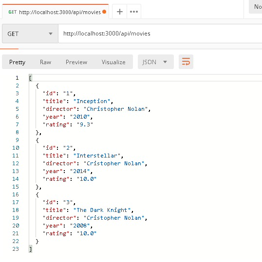
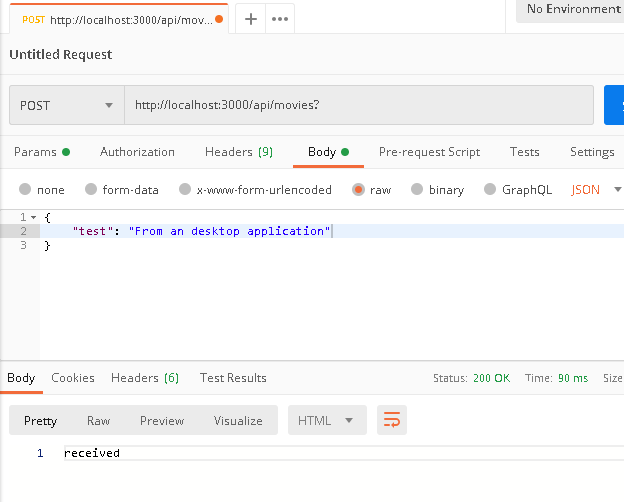
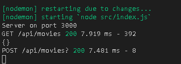

# REST API con Node.js

Para modelos Cliente - Servidor. El servidor escucha las peticiones del cliente. El servidor devuelve datos al cliente desde una base de datos. La base de datos está conectada al servidor.

Si tenemos una aplicación para el cliente y deseamos obtener los datos haciendo peticiones al servidor. Estas peticiones se las hace a rutas del servidor, basados en una REST API.

REST API son rutas del servidor que pueden ser accedidas por aplicaciones externas. Rutas que permiten a otro tipo de aplicación interactuar con el servidor. REST API no es más que un conjunto de reglas de como diseñar estas ruta.

* Usaremos `Node.js` como el servidor. Simularemos la base de datos con un archivo JSON.
* Como ejemplo definiremos rutas para películas. Ejemplo: `/api/movies`.
* Para obtener usamos `GET`
* Para crear usamos `POST`
* Para actualizar usamos `PUT`
* Para eliminar usamos `DELETE`

## Herramientas

* Node.js
* Editor Visual Studio Code
* Postman

## Crear servidor

1. Creamos una carpeta que contenga todo nuestro proyecto.
2. Abrimos la terminal dentro de la carpeta en Visual Studio Code `Ctrl + Shift + ñ`.
3. Iniciamos el proyecto.

```console
npm init --yes
```
Esto creará un `package.json`, que nos permite describir nuestro proyecto.

4. Instalamos los módulos que usaremos, `express` y `morgan`.

```console
npm i express morgan
```

* Express es un framework de Node del servidor que nos permite describir código del servidor de una manera sencilla.

* Morgan es un módulo que nos permite ver por consola las peticiones que van llegando.

5. Crearemos una carpeta que contenga nuestro proyecto `src`.
6. Dentro de esta carpeta creamos la carpeta `index.js`
7. Iniciamos que el servidor empiece a escuchar en el puerto 3000.

```javascript
const express = require('express');
const app = express();

//start server 
app.listen(3000, ()=>{
    console.log(`Server on port ${3000}`);
});
```

8. Usamos el middleware morgan.

```javascript
const express = require('express');
const app = express();
const morgan = require('morgan');

//middlewares
app.use(morgan('dev'));

//start server 
app.listen(3000, ()=>{
    console.log(`Server on port ${3000}`);
});
```

9. Iniciamos el servidor.

```console
node src/index.js
```

10. Si abrimos el navegador en localhost:3000 observamos en la consola:

```console
GET / 404 5.751 ms - 139
```
Quiere decir que se ha realizado una petición al servidor, sin embargo no se ha obtenido nada.

11. Implementamos la siguiente línea para que el servidor poder recibir formato JSON y entenderlos.

```javascript
app.use(express.json());
```
12.  Implementamos también la siguiente línea para que el servidor pueda recibir y entender los datos que llegan desde un formulario.
 
```javascript
app.use(express.urlencoded({extended: false}));
```

13. Modificamos como una especie de variable al puerto y modificamos el inicio del servidor.

```javascript
app.set('port', process.env.PORT || 3000);

app.listen(app.get('port'), ()=>{
    console.log(`Server on port ${app.get('port')}`);
});
```

14. Creamos una ruta simple '/'.

```javascript
//routes
app.get('/', (req, res) => {
    res.send('Hello World');
} );
```

15. Instalamos un nodemon como una dependencia de desarrollo (opción -D).

```javascript
npm i nodemon -D
```

16. Entonces dentro de `package.json` creamos el script `dev` que ejecutará el index.js.

```json
"scripts": {
    "dev" : "nodemon src/index.js"
  },
```

17. Ejecutamos el servidor.

```console
npm run dev
```

## Creación de rutas

1. Creamos dentro de `src` una nueva carpeta llamada `routes`.

2. Dentro creamos un archivo `index.js`

3. Creamos las rutas, importando los módulos requeridos y lo exportamos.
   
```javascript
const { Router  } = require('express');
const router = Router();

//routes
router.get('/test', (req, res) => {
    const data = {
        'name':'diego',
        'github':'diegodavidq'
    };
    res.json(data);
} );

module.exports = router;
```
4. Creamos la ruta para movies.

```javascript
const { Router  } = require('express');
const router = Router();

const movies = require('../sample.json');

//routes
router.get('/', (req, res) => {
    res.json(movies);
} );

router.post('/', (req, res) => {
    console.log(req.body);
    res.send('received');
});

module.exports = router;
```

5. Realizamos una petición GET al servidor usando Postman.

<p align="center">
	
</p>

6. Realizamos una petición POST al servidor usando Postman.

* Para esto en Header agregamos en key `Content-Type` y en valor `application/json`
* Enviamos el json a través de la propiedad body y seleccionamos `raw`

<p align="center">
	
</p>

Observamos que como respuesta obtenemos recibido, también podemos verificarlo en la consola del servidor.

<p align="center">
	
</p>

7. Instalamos underscore
```console
npm i underscore
```
8. Instalamos node-fetch

```console
npm i node-fetch
```
